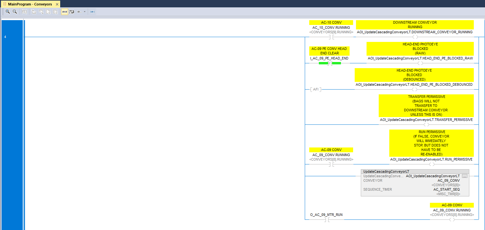
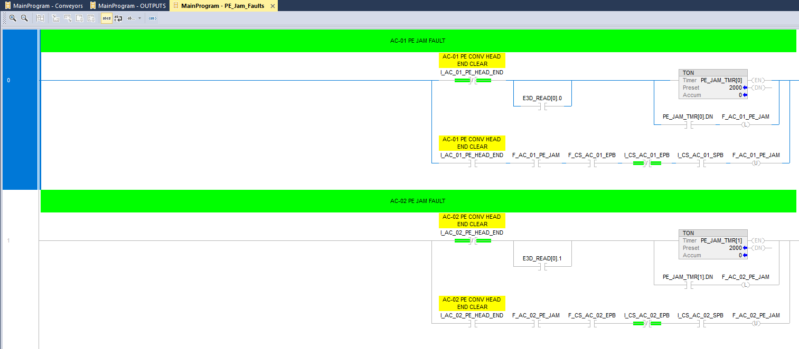

## Virtual Conveyor System Simulation - Austin Shelton

---

## Project Problem

Modern manufacturing relies heavily on conveyor systems for efficient product movement.  
However, physical testing and operator training can be expensive and risky.

---

## Sprint 1 Deliverables

Sprint 1 Goals:

Implement PLC Ladder logic

Build movement & sensor logic

Define and build integration logic

Have routines working properly for testing

---

## Sprint 1 Lookback

Good things:
Built good and functioning logic
Able to test
Communication between my "partner"

Bad things:
Time management
Goal setting

---

## Sprint 2 Goals 

Sprint 2 Goals:

Continue Development of Conv System (Full integration)

Start on HMI (Control Stations Virtual)

Enable User interaction between PLC and FactoryTalk

---

## Project Requirements

LoC: 400 lines of code / 11 Routines & 40 Rungs

Features completed: 4/4

Requirements completed: 4/4

---

## Conv

---

## PE fault

---

# Questions?

Thank you for your time!